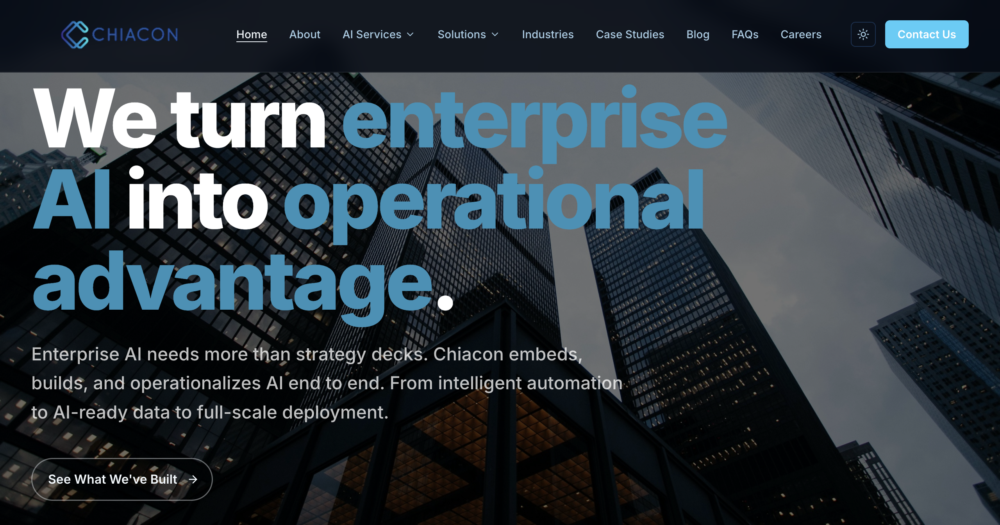
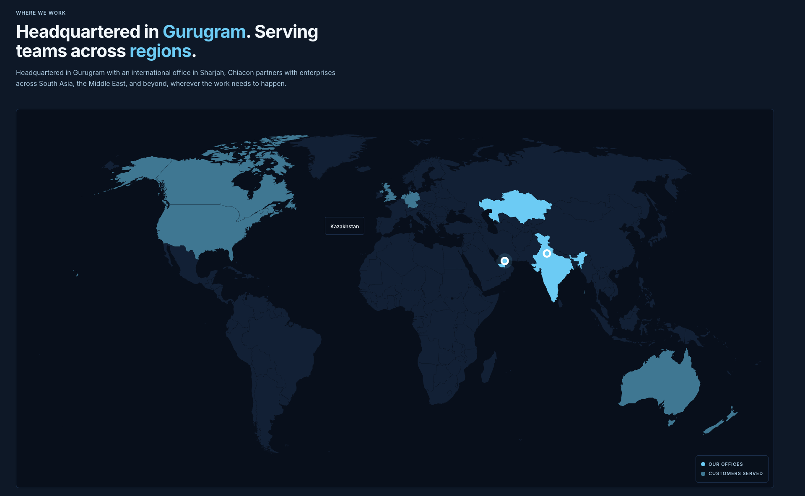
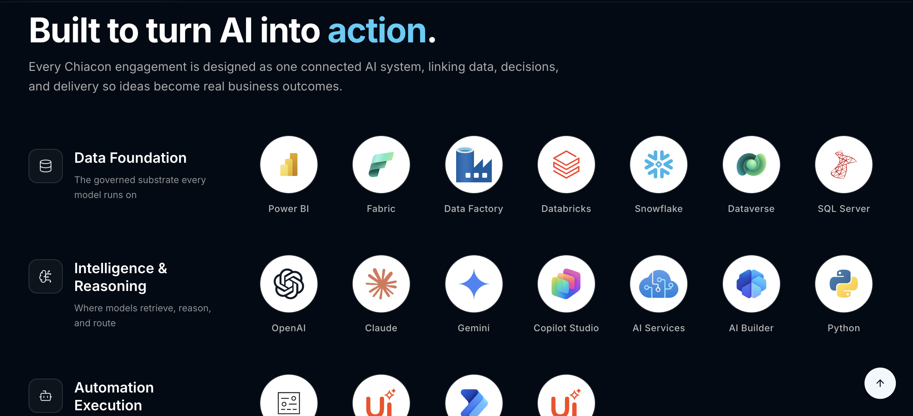
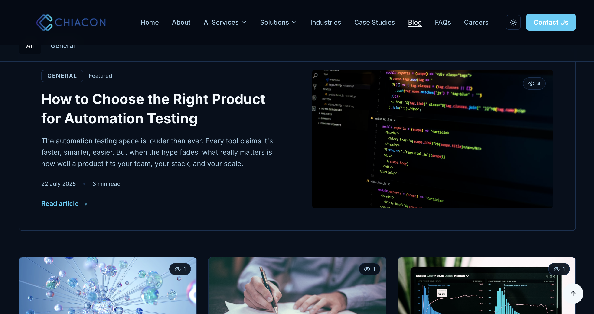
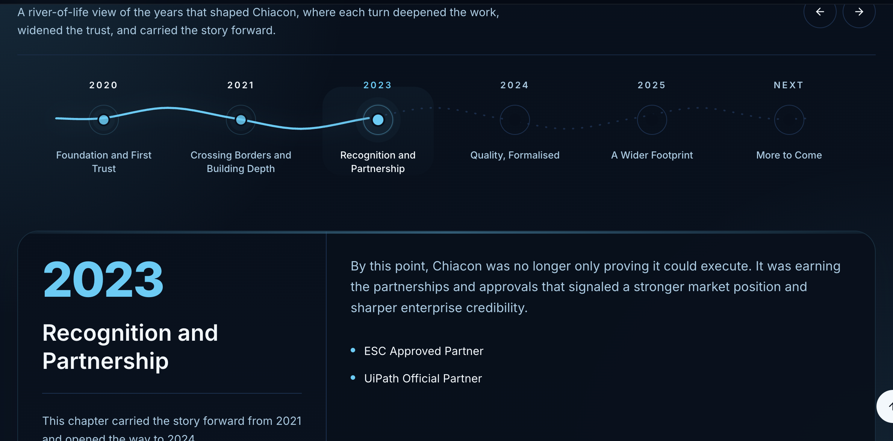
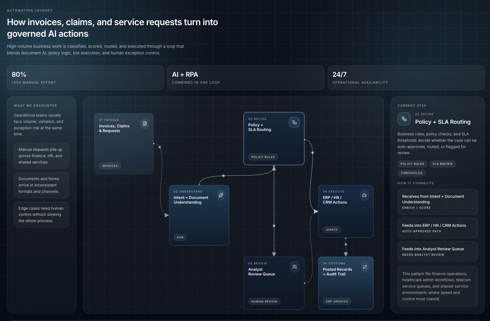

# Chiacon

### Enterprise Website Redesign

A full-stack rebuild for an enterprise technology consulting firm, 
migrating from a template platform to a custom, production-grade Next.js application.

 

**[ &nbsp; View Live Site &nbsp; ↗ ](https://chiacon-website.vercel.app)**

 

`Next.js 16` &nbsp;·&nbsp; `TypeScript` &nbsp;·&nbsp; `Tailwind CSS` &nbsp;·&nbsp; `Framer Motion` &nbsp;·&nbsp; `Three.js` &nbsp;·&nbsp; `Notion CMS`

 

**Solo build &nbsp;·&nbsp; 4 weeks &nbsp;·&nbsp; 27+ pages &nbsp;·&nbsp; Deployed on Vercel**

 

 

---

## Gallery

<table>
  <tr>
    <td width="50%"></td>
    <td width="50%"></td>
  </tr>
  <tr>
    <td align="center"><b>Homepage</b> Dark mode</td>
    <td align="center"><b>Homepage</b> Light mode</td>
  </tr>
  <tr>
    <td width="50%"></td>
    <td width="50%"></td>
  </tr>
  <tr>
    <td align="center"><b>Services</b></td>
    <td align="center"><b>Solutions</b></td>
  </tr>
  <tr>
    <td width="50%"></td>
    <td width="50%"></td>
  </tr>
  <tr>
    <td align="center"><b>About</b></td>
    <td align="center"><b>Contact</b></td>
  </tr>
</table>

 

---

## Overview

The client was running on a template website builder with no code ownership, limited SEO control, and a generic design that did not match the credibility of an enterprise consulting firm.

I was brought on to redesign and rebuild the entire web presence on a modern, fully-owned stack. The result is a fast, accessible, fully responsive website with a custom design system, dark and light mode, a self-serve content workflow for the marketing team, and a Lighthouse score of 90+ on every page.

 

## My Role

I owned the project end to end, from discovery through design, engineering, and launch.

| | |
|:--|:--|
| **Discovery & Strategy** | Translated business goals into a complete site architecture and content plan |
| **Design System** | Built a minimal, enterprise-grade visual language from scratch |
| **Engineering** | Architected and coded the entire front end and back end, solo |
| **SEO & Performance** | Structured data, sitemap, redirects, and a 90+ Lighthouse target |
| **Launch** | Production deployment and go-live |

 

## How I Approached It

 

> ### 1. Understood the problem before building
>
> Before writing any code, I mapped what the website needed to do, not just how it should look. Three priorities shaped every decision: **credibility** (read as a serious enterprise presence), **independence** (let marketing publish without a developer), and **continuity** (lose no SEO value in the migration).

 

> ### 2. Planned the whole build up front
>
> I wrote a complete project roadmap covering the sitemap, page specs, component plan, rendering strategy, and a day-by-day schedule before touching the codebase. When ambiguous decisions came up mid-build, the answer was already documented.

 

> ### 3. Built foundation first, pages last
>
> I worked bottom up: design tokens, then reusable UI components, then layout shell, then full pages. By the time I assembled pages, every building block already worked exactly as intended, so there was no rework.

 

> ### 4. Made deliberate engineering trade-offs
>
> **Self-serve content.** Wired the blog to a tool the marketing team already used daily, so publishing is a one-click action with zero developer involvement.
>
> **Lightweight live analytics.** Added per-post engagement tracking with a tiny serverless layer instead of a heavy third-party analytics product.
>
> **Custom WebGL visuals.** Hand-wrote a GPU shader for a hero background where I needed perfectly smooth, infinitely looping motion that off-the-shelf tools could not match.
>
> **Smart rendering.** Static generation by default for speed, incremental regeneration only where live content demanded it. This kept performance scores high everywhere.

 

> ### 5. Designed with restraint
>
> I benchmarked the visual language against firms like ThoughtWorks, Stripe, and Vercel: confident whitespace, typography doing the heavy lifting, and motion that guides attention rather than showing off. Every element had to earn its place by making the content more credible, not just busier.

 

---

## Tech Stack

<table>
  <tr>
    <td><b>Framework & Language</b></td>
    <td>Next.js 16 (App Router), React 19, TypeScript, Tailwind CSS</td>
  </tr>
  <tr>
    <td><b>Animation & 3D</b></td>
    <td>Framer Motion, Three.js / React Three Fiber, custom GLSL shaders, Lottie, light/dark theming</td>
  </tr>
  <tr>
    <td><b>Back End & Integrations</b></td>
    <td>Serverless API routes, headless CMS, serverless KV store, transactional email, schema validation, bot protection</td>
  </tr>
  <tr>
    <td><b>Infrastructure</b></td>
    <td>Vercel edge CDN, structured data & sitemap, security headers, SEO-preserving redirects</td>
  </tr>
</table>

 

---

## Results

| Pages | Lighthouse | Content Workflow | SEO Migration | Timeline |
|:---:|:---:|:---:|:---:|:---:|
| **27+** | **90+** | **Self-serve** | **Zero loss** | **4 weeks** |

Lighthouse scores 90+ across Performance, Accessibility, Best Practices, and SEO on every page.

 

---

## Context

Built during my internship at an enterprise technology consulting firm in 2026. The source code is private and client-owned. This repository documents the architecture, design decisions, and engineering approach behind the project.

 

**[ Live Site ↗ ](https://chiacon-website.vercel.app)** &nbsp;&nbsp;|&nbsp;&nbsp; **[ Portfolio ↗ ](https://nishant7p.github.io)**

 

Nishant Tomer &nbsp;·&nbsp; IIIT-Delhi &nbsp;·&nbsp; B.Tech CSAM 2023–27

